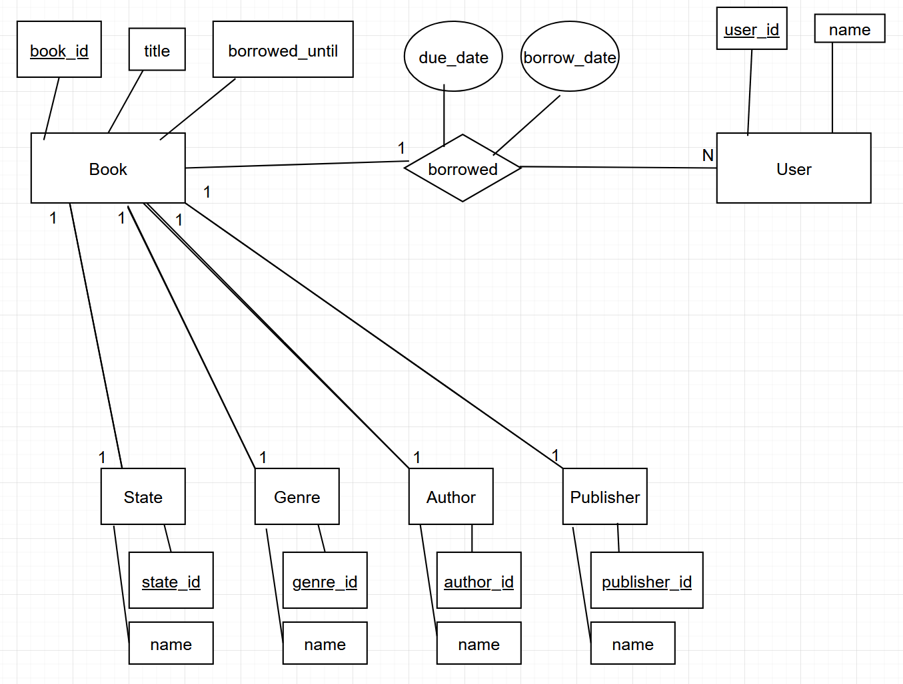

# library_management_task
Basic Library Management System 

### Steps
1. Open cmd/terminal and clone the repository (ensure git is installed or use GutHub Desktop)
```bash
git clone https://github.com/clumsyspeedboat/library_management_task.git
```
2. "cd" into the repository
```bash
cd <path_to_your_dir>/library_management_task
```
3. Create virtual environment (ensure python is installed and added to PATH)
```bash
python -m venv env
```
4. Activate virtual environment
```bash
env\Scripts\activate # on Windows
source env/bin/activate # on Linux/Mac
```
5. Install dependencies/packages
```bash
pip install -r requirements.txt
```
5. Run Flask app
```bash
python app.py
```
6. Navigate to localhost (port will be displayed in terminal)
```bash
http://localhost:5000 # Most probably
```

# Assignments

## Nr 1
### Discuss with the client about potential improvements, features, and data requirements for managing their library effectively.

Potential improvements:
* Switch from xml-files to a DBS
* Generate the description only once. When adding book.
* Search with parameters
* Implementation of cccounts
* User:
    * List of borrowed books
    * recommendations
* Staff:
    * Adding books, authors, publisher, genre
    * Login for staff to see confidential data
    * Page for overdue books


Features: 
* Filters (state of the book, auther, publisher, genre)
* New read-later-list

Data requirement:
